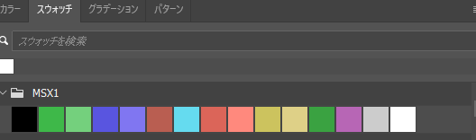

# Pixel Art Validator MSX1 (Photoshop UXP Plugin)

※ 日本語情報は別ページにあります。 [README_JP.md](README_JP.md)

## 🔧 Tool Overview

This tool checks the regulations (up to 2 colors within 8 horizontal dots, up to 16 colors in total or 15 colors excluding transparency) when you want to reproduce the screen of a machine using TMS9918 as an image chip such as MSX1 with pixel art. It does not check the overall size of the image (256*192).

* It seems that the program cannot analyze images in INDEX color mode. Please switch to RGB 8-bit mode.

## 📌 Features
- Check if the pixels in the layer fit within 2 colors in 8 horizontal pixels.
- Detect the use of more than 15 colors.
- Select areas that violate the regulations.

## ⚙️ Preparation

Since it is not planned to be distributed on the marketplace, it needs to be installed in Photoshop's developer mode. Here are the preparations:

* Obtain UXP Developer tools
  * Install UXP Developer tools from the app list in the Adobe Creative Cloud app.

* Enable Photoshop UXP Developer Mode
  * Open Photoshop
  * Go to "Edit" → "Preferences" → "Plugins"
  * Check "Enable UXP Developer Mode"
  * Restart Photoshop

## 📥 Installation

* Download the ZIP file from the release page and place it in an appropriate location.
* Alternatively, clone this repository to a local folder.
* Launch Photoshop.
* Launch UXP Developer tools.
* Select Add Plugin.
* Select the manifest.json file in the folder you just extracted or cloned.
* The tool will appear in the plugin list, press the Load button.

## 🛠️ Usage
* Find this plugin in the plugin menu and open the panel.

* Select a single layer with the image you want to check.
* Enter the total number of available colors in the panel and press the button.
* If a regulation violation is found, the area will be selected.

## 💀 Known Issue

* Guaranteed to work only in RGB 8-bit color mode. Does not work in INDEX color mode.
* If there are many errors, it may take several seconds to complete the process.

## 🎁 Bonus File

* [msx1_palette.aco](msx1_palette.aco)
  This is an MSX1 palette file that can be used with Photoshop's color palette (swatches). It can be used as a selectable color when drawing.

  

* [msx1_palette.act](msx1_palette.act)
  This is an MSX1 palette file that can be used when exporting palette GIFs with Photoshop's traditional web export. It can be loaded when exporting palette GIFs.

  

