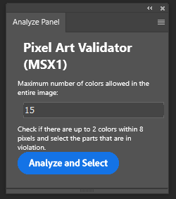
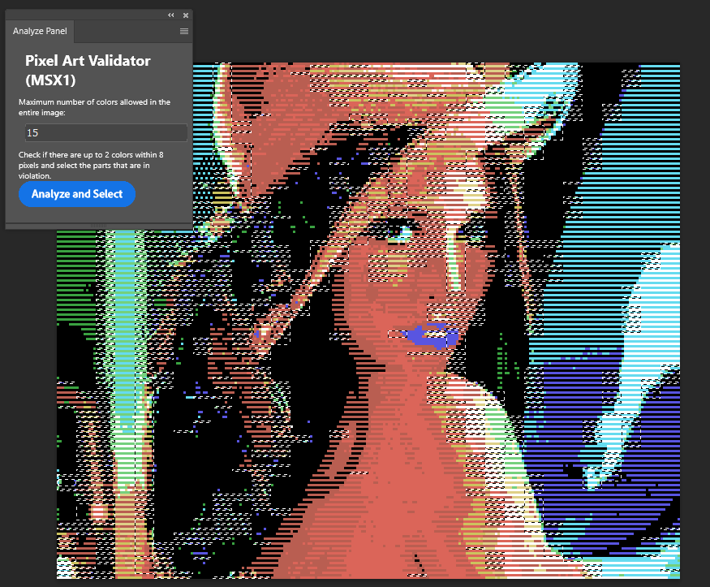
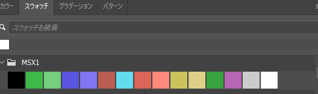
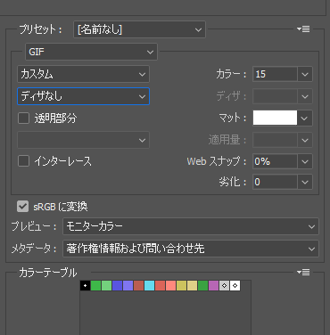

# Pixel Art Validator MSX1 (Photoshop UXP Plugin)

The English README is here: [README.md](README.md)

## 🔧 ツール概要

MSX1などTMS9918を画像チップとして私用しているマシンの画面をドット絵で再現したい際に、問題となるレギュレーション
（横8ドット内に2色まで、画像全体で16色または透明をのぞいて15色まで）をチェックするツールです。画像全体のサイズ(正しくは256*192)の確認はしていません。

※ INDEXカラーモードではプログラムによる画像の解析がウなくできないようです。RGB 8ビットモードに切り替えて下さい。

## 📌 機能
- レイヤーのpイクセルが横8ピクセルに2色に収まっているかレギュレーションチェック。
- 15色以上の使用を検知。
- レギュレーション違反箇所を選択範囲とする。

## ⚙️ 事前準備

マーケットプレースでの配布を予定していないので、Photoshopの開発者モードでインストールする必要があります。そのための準備をします。

* UXP Developer tools を入手する
  * Adobe Crative Cloud アプリの アプリ一覧から UXP Developer tools をインストールします。

* Photoshop の UXP 開発者モードを有効にする
  * Photoshop を開く
  * 「編集」 → 「環境設定」 → 「プラグイン」
  * 「UXP 開発者モードを有効にする」 にチェックを入れる
  * Photoshop を再起動

## 📥 インストール方法

* [リリースページ](https://github.com/harayoki/Photshop_UXP_PixelArtValidatorMSX1/releases) から ZIP ファイルをダウンロードして適当な場所に配置します。
* もしくは、このリポジトリをローカルフォルダにクローンする。
* Photoshopを立ち上げます。
* UXP Developer tools を立ち上げます。
* Add Plugin を選択します。
* 先ほど解凍またはクローンしたフォルダ内にあるmanifest.jsonファイルを選択します。
* プラグイン一覧にk尾のツールが並ぶので、Loadボタンを押します。

## 🛠️ 使い方

* プラグインメニューからこのプラグインの項目を探し、パネルを開きます。

* チェックしたい画像のあるレイヤーを１つ選択します。
* パネルに全体の利用可能色数を入力し、ボタンを押します。
* レギュレーション違反が見つかった場合、その箇所が選択されます。

## 💀 既知の問題

* RGB8bitカラーモードでのみ動作を保証します。INDEXカラーでは動作しません。
* 配色エラー個所が多い場合、処理完了まで数秒ほど時間がかかります。

## 🎁 おまけファイル

* [msx1_palette.aco](msx1_palette.aco)
  Photoshopのカラーパレット（スウォッチ）で使える使えるMSX1パレットファイルです。絵を描く際に選択カラーとして使えます。

  

* [msx1_palette.act](msx1_palette.act)
  Photoshopの従来のweb書き出しでパレットGIFを書き出す際に使えるMSX1パレットファイルです。パレットGIF書き出し時に読み込めます。

  

